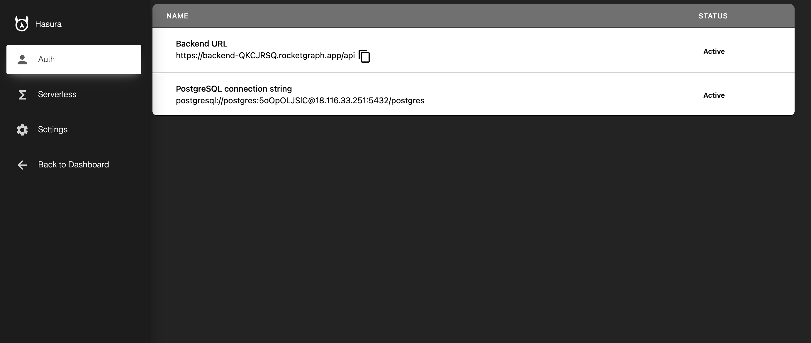

  

<h1 align="center">
  Rocketgraph :rocket:
</h1>

<h3 align="center">
  <!-- <b><a href="https://app.appsmith.com/signup/?utm_source=github&utm_medium=social&utm_content=website&utm_campaign=null&utm_term=website">Get Started</a></b> -->

  <a href="https://docs.rocketgraph.io">Docs</a>
  •
  <a href="https://youtu.be/K5TGDapSnQw">Youtube</a>
  •
  <a href="https://discord.gg/YHVnZ5WT">Discord</a>
  •
  <a href="https://github.com/RocketsGraphQL/rgraph/tree/master/example-setups">Templates</a> 
  </h3>

  
  

  

 

**Rocketgraph** is a complete Backend. When you create a project on [rocketgraph](https://rocketgraph.io/) you are provided with [Postgres Instance](https://www.postgresql.org/), [Hasura console](https://hasura.io/), Automated backend deployments with Git, and a full blown authentication system built in. It uses the open-source [Hasura Batteries](https://github.com/RocketsGraphQL/hasura-batteries) to power it's authentication service.

## Table of contents

- [Introduction](#introduction)
- [Getting Started](#getting-started)
- [Docs](http://docs.rocketgraph.io/)
- [Join Community](https://discord.gg/YHVnZ5WT)

# Introduction

 

### We offer the following functionality

- ✅ Sign-in / Sign-up with email ID and password
- ✅ Secure session management with cookies refreshed periodically
- ✅ Email verification
- ✅ Database: 8gb Postgres db
- ✅ Social logins (Google, Github, Facebook, more coming soon)
- ✅ Role-based access management
- ✅ Automated backend deployments. Bring your own code and your github commits are auto deployed as Lambda functions.

 

 

<!-- ## Roadmap

- Support more JWT encryption algorithms (Currently supporting HS256)
- 2 Factor authentication
- Back office (Admin dashboard to manage user)
- Support more database
- VueJS SDK
- Svelte SDK
- React Native SDK
- Flutter SDK
- Android Native SDK
- iOS native SDK
- Golang SDK
- Python SDK
- PHP SDK
- WordPress plugin
- Kubernetes Helm Chart
- [Local Stack](https://github.com/localstack/localstack)
- AMI
- Digital Ocean Droplet
- Azure
- Render
- Edge Deployment using Fly.io
- Password-less login with mobile number and OTP SMS -->

# Getting Started

## Trying out Rocketgraph

This guide helps you get started with rocketgraph and setting up your backend in just 15 minutes. In 15 minutes you will be able to create a todos app with db, auth and realtime subscriptions.

### Create account
Your first instance is free for 14 days. No credit card.
So go to [the signup page](https://rocketgraph.io/signup) and create account. Then on the dashboard click new project. Wait for a few seconds for the instance to boot up and load the software.

### Project setup
You can see your hasura console url. There you can manage your database.
Follow this [documentation](https://docs.rocketgraph.io/setup) to get started

### Code setup
For your front-end, you can start with the already provided [examples](https://github.com/RocketsGraphQL/example-setups). Just download and `npm run dev`. Todos is without authentication, auth is with authentication.

## Testing

- We use cypress tests on all the examples provided.

---
 

