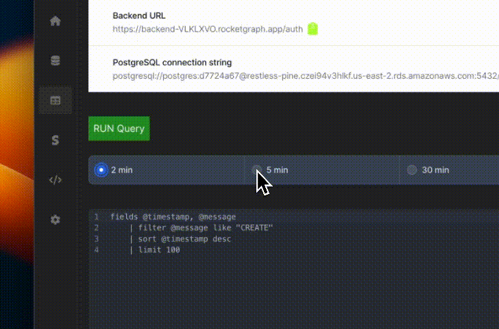

<p align="center">
  <a href="https://twitter.com/RGraphql">
    
  </a>
</p>
<h1 align="center">
  RocketGraphQL :rocket:
</h1>

<h3 align="center">
  <!-- <b><a href="https://app.appsmith.com/signup/?utm_source=github&utm_medium=social&utm_content=website&utm_campaign=null&utm_term=website">Get Started</a></b> -->

  <a href="https://docs.rocketgraph.io">Docs</a>
  •
  <a href="https://youtu.be/K5TGDapSnQw">Youtube</a>
  •
  <a href="https://discord.gg/YHVnZ5WT">Discord</a>
  •
  <a href="https://github.com/RocketsGraphQL/rgraph/tree/master/example-setups">Templates</a> 
  </h3>

<p align="center">

<p align="center">
  <a href="https://twitter.com/RGraphql"></a>
  <a href="https://twitter.com/RGraphql"></a>
</p>

<p>
  
</p>

<br />

**Rocketgraph** gives superpowers to your web applications. Get Authentication, realtime GraphQL, Serverless functions and a Postgres DB right from day 0. When you create a project on [rocketgraph](https://rocketgraph.io/) you are provided with [Postgres Instance](https://www.postgresql.org/), [Hasura console](https://hasura.io/) to get a GraphQL API and manage granular authorisation rules, Automated backend deployments with Git, and a full blown authentication system built in. It uses the open-source [Hasura Batteries](https://github.com/RocketsGraphQL/hasura-batteries) to power it's authentication service.

## Table of contents

- [Introduction](#introduction)
- [Getting Started](#getting-started)
- [Docs](http://docs.rocketgraph.io/)
- [Join Community](https://discord.gg/YHVnZ5WT)

# Introduction


<br />

### We offer the following functionality

- 🔒 Authentication using email/password
- 👬 Authentication using social logins
- 🪄 Authentication using OTP and magic link
- ⛈️ Server-less functions: Bring your own code and run it as thin AWS lambdas.
- 👨‍💻 Your code will be automatically picked up from your Github commits by our Github bot and deployed as Lambdas
- 🦾 AWS RDS support: 8GB PostgreSQL
- 👩‍🚀 Postgres Logs using `pgAudit`
- 🍪 Secure session management with cookies refreshed automatically

<br />


<br />


<!-- ## Roadmap

- Support more JWT encryption algorithms (Currently supporting HS256)
- 2 Factor authentication
- Back office (Admin dashboard to manage user)
- Support more database
- VueJS SDK
- Svelte SDK
- React Native SDK
- Flutter SDK
- Android Native SDK
- iOS native SDK
- Golang SDK
- Python SDK
- PHP SDK
- WordPress plugin
- Kubernetes Helm Chart
- [Local Stack](https://github.com/localstack/localstack)
- AMI
- Digital Ocean Droplet
- Azure
- Render
- Edge Deployment using Fly.io
- Password-less login with mobile number and OTP SMS -->

# Getting Started

## Trying out Rocketgraph

This guide helps you get started with rocketgraph and setting up your backend in just 15 minutes. In 15 minutes you will be able to create a todos app with db, auth and realtime subscriptions.

### Create account
Your first instance is free for 14 days. No credit card.
So go to [the signup page](https://rocketgraph.io/signup) and create account. Then on the dashboard click new project. Wait for a few seconds for the instance to boot up and load the software.


### Project setup
You can see your hasura console url. There you can manage your database.


And links to your Backend URLs


### Code setup TLDR version

For your front-end, you can start with the already provided [examples](https://github.com/RocketsGraphQL/example-setups). Just download and `npm run dev`. `todos` is without authentication, `auth` is with authentication.

<p align="center">

</p>
<br />

### Code setup (just the basics)

```bash
npx create-react-app todos
cd todos
```

```bash
yarn add react-router-dom react-router
yarn add @apollo/client @rocketgraphql/react-apollo @rocketgraphql/rocketgraph-js-sdk graphql
```

Next create `src/utils/config.js` and add the following:

```js
import { createClient } from "@rocketgraphql/rocketgraph-js-sdk";
 
const config = {
  baseURL: "https://backend-XXXXXXX.rocketgraph.app/auth",
};
 
const { auth } = createClient(config);
 
export { auth };
```

Replace the `backend-XXX` URL with the url on your Rocketgraph dashboard. Congratulations, you have setup the basics required to use Rocketgraph.


### RApolloProvider

Use GraphQL in your application, `index.js` by wrapping your App in RApolloProvider as follows:

```js
// src/index.js
import React from "react";
import ReactDOM from "react-dom";
import { ChakraProvider } from '@chakra-ui/react'
import { BrowserRouter as Router, Routes, Route } from "react-router-dom";
import App from "./App";
import Message from "./components/Message"
import Login from "./components/Login"
import Signup from "./components/Signup"

// Rocketgraph providers
import { RApolloProvider } from "@rocketgraphql/react-apollo";
import { auth } from "./utils/config";

ReactDOM.render(
  <React.StrictMode>
    <ChakraProvider>
      <RApolloProvider auth={auth} gqlEndpoint="https://hasura-AEF0WTE.rocketgraph.app/v1/graphql">
        <Router>
          <Routes>
            <Route path="/login" element={<Login />}/>
            <Route path="/signup" element={<Signup />}/>
            <Route path="/messages" element={<Message />} />
            <Route path="/" element={<App />} />
          </Routes>
        </Router>
      </RApolloProvider>
    </ChakraProvider>
  </React.StrictMode>,
  document.getElementById("root")
);
```

Then in your App.js file

```js
import { gql, useSubscription } from "@apollo/client";

const GET_TODOS = gql`
    subscription {
      users {
        id
        email
      }
    }
`;

export default function Application() {
  const [ data, loading] = useSubscription(GET_TODOS);
}

```

## Postgres Logs using pgAudit

In your logs dasboard you can write complex queries to query your logs. Use [cloudwatch logs syntax](https://docs.aws.amazon.com/AmazonCloudWatch/latest/logs/CWL_QuerySyntax.html)

<p>
  
</p>


## Run on your machine (self-hosted)

See : https://github.com/RocketsGraphQL/hasura-batteries

To run this as a standalone docker container.

## Testing

- We use cypress tests on all the examples provided. Run them using `cypress`
- We use unit tests and CI pipelines, see: https://github.com/RocketsGraphQL/hasura-batteries


---
<br />
<p align="center">
<a href="https://www.buymeacoffee.com/kaushikv" target="_blank"></a>
</p>

